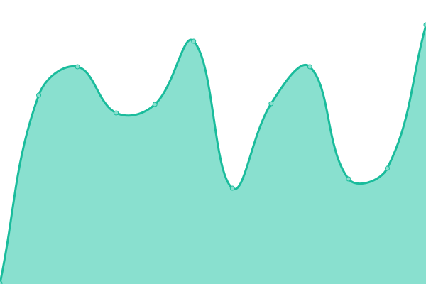
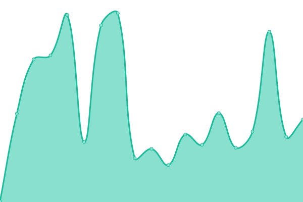
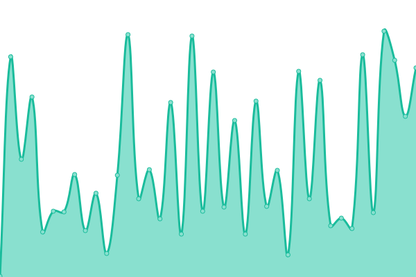
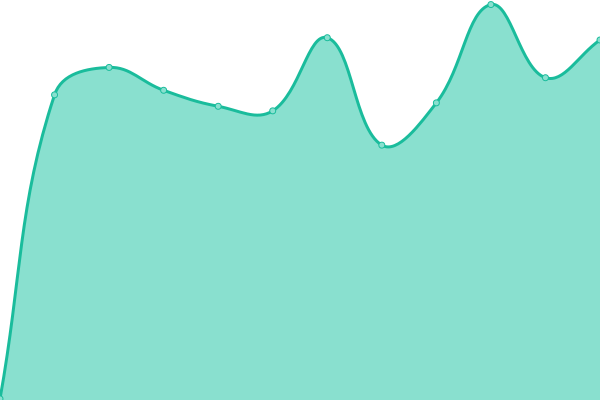

# [📈 Live Status](https://status.actionsack.com): <!--live status--> **🟩 All systems operational**

This repository contains the open-source uptime monitor and status page for [xnaas](https://xnaas.info/), powered by [Upptime](https://github.com/upptime/upptime).

With [Upptime](https://upptime.js.org), you can get your own unlimited and free uptime monitor and status page, powered entirely by a GitHub repository. We use [Issues](https://github.com/xnaas/status-asak/issues) as incident reports, [Actions](https://github.com/xnaas/status-asak/actions) as uptime monitors, and [Pages](https://xnaas.github.io/status-asak) for the status page.

<!--start: status pages-->
<!-- This summary is generated by Upptime (https://github.com/upptime/upptime) -->
<!-- Do not edit this manually, your changes will be overwritten -->
<!-- prettier-ignore -->
| URL | Status | History | Response Time | Uptime |
| --- | ------ | ------- | ------------- | ------ |
|  [Homepage](https://actionsack.com) | 🟩 Up | [homepage.yml](https://github.com/xnaas/asak-status/commits/HEAD/history/homepage.yml) | 

 347ms
     
 | 

<a href="https://status.actionsack.com/history/homepage">100.00%</a>
    

|  [IRC](chat.actionsack.com) | 🟩 Up | [irc.yml](https://github.com/xnaas/asak-status/commits/HEAD/history/irc.yml) | 

 65ms
     
 | 

<a href="https://status.actionsack.com/history/irc">100.00%</a>
    

|  [Webchat](https://webchat.actionsack.com) | 🟩 Up | [webchat.yml](https://github.com/xnaas/asak-status/commits/HEAD/history/webchat.yml) | 

 294ms
     
 | 

<a href="https://status.actionsack.com/history/webchat">100.00%</a>
    

|  [Mumble](chat.actionsack.com) | 🟩 Up | [mumble.yml](https://github.com/xnaas/asak-status/commits/HEAD/history/mumble.yml) | 

 61ms
     
 | 

<a href="https://status.actionsack.com/history/mumble">100.00%</a>
    

|  [Nitter](https://nitter.actionsack.com) | 🟩 Up | [nitter.yml](https://github.com/xnaas/asak-status/commits/HEAD/history/nitter.yml) | 

 254ms
     
 | 

<a href="https://status.actionsack.com/history/nitter">100.00%</a>
    

|  [OpenTogetherTube](https://ott.actionsack.com) | 🟩 Up | [open-together-tube.yml](https://github.com/xnaas/asak-status/commits/HEAD/history/open-together-tube.yml) | 

 286ms
     
 | 

<a href="https://status.actionsack.com/history/open-together-tube">100.00%</a>
    

|  [rimgu](https://i.actionsack.com/favicon.ico) | 🟩 Up | [rimgu.yml](https://github.com/xnaas/asak-status/commits/HEAD/history/rimgu.yml) | 

 416ms
     
 | 

<a href="https://status.actionsack.com/history/rimgu">100.00%</a>
    

|  RSS-Bridge 🔒 | 🟩 Up | [rss-bridge.yml](https://github.com/xnaas/asak-status/commits/HEAD/history/rss-bridge.yml) | 

 459ms
     
 | 

<a href="https://status.actionsack.com/history/rss-bridge">100.00%</a>
    

|  [Send](https://send.actionsack.com) | 🟩 Up | [send.yml](https://github.com/xnaas/asak-status/commits/HEAD/history/send.yml) | 

 254ms
     
 | 

<a href="https://status.actionsack.com/history/send">100.00%</a>
    

|  [youtube-dl](https://ytdl.actionsack.com) | 🟩 Up | [youtube-dl.yml](https://github.com/xnaas/asak-status/commits/HEAD/history/youtube-dl.yml) | 

 232ms
     
 | 

<a href="https://status.actionsack.com/history/youtube-dl">100.00%</a>
    

|  [Download 🔒](https://dl.actionsack.com) | 🟩 Up | [download.yml](https://github.com/xnaas/asak-status/commits/HEAD/history/download.yml) | 

 568ms
     
 | 

<a href="https://status.actionsack.com/history/download">100.00%</a>
    

|  [Meme Wiki](https://srsbznz.actionsack.com) | 🟩 Up | [meme-wiki.yml](https://github.com/xnaas/asak-status/commits/HEAD/history/meme-wiki.yml) | 

 340ms
     
 | 

<a href="https://status.actionsack.com/history/meme-wiki">100.00%</a>
    

<!--end: status pages-->

[**Visit our status website →**](https://xnaas.github.io/status-asak)

## 📄 License

- Powered by: [Upptime](https://github.com/upptime/upptime)
- Code: [MIT](./LICENSE) © [xnaas](https://xnaas.info/)
- Data in the `./history` directory: [Open Database License](https://opendatacommons.org/licenses/odbl/1-0/)
